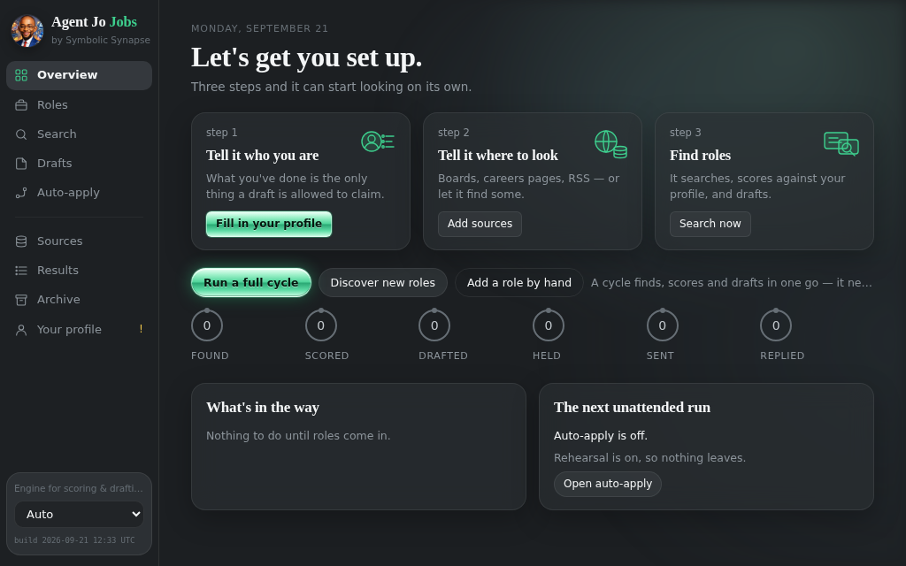

# Agent Jo Jobs

**A job search that runs on your own machine** — and won't send an application
that says something about you that isn't true.

It finds roles on the boards you choose, scores each one against your profile,
drafts the application, and **holds any draft that claims a tool, an employer
or a number of years your profile can't support**. Then it learns which
sources actually produce replies.

*by Symbolic Synapse*



---

## What it does

**Finds** — your boards, careers pages, RSS feeds, and the alert emails from
boards that block scraping. It checks a board returns roles before adding it.

**Scores** — each role against what you've actually done, with a free keyword
check before any engine is called.

**Drafts** — a covering note, a tailored CV, interview preparation. Every
claim in a draft is checked against your profile; anything unsupported is
held with the exact claim shown.

**Applies** — by email, or through a company's portal with a rehearsal first.
Auto-apply runs unattended within limits you set, and rehearsal keeps
everything local until you're sure.

**Learns** — which boards reply, whether your fit score predicts anything, and
whether email beats a portal. Every rate carries the range it could really be.

## Install

Windows — double-click **`install.bat`**. It finds or installs Python, sets
up an isolated environment, checks the app loads, and puts an **Agent Jo Jobs**
shortcut on your desktop.

macOS — double-click `install.command`. Linux — `./install.sh`.

It opens at **http://127.0.0.1:8766**. Point it at a local Ollama model and
nothing leaves your machine; or add a cloud engine with its own key.

## Your data

Everything lives in `~/.local_agent` (`C:\Users\<you>\.local_agent` on
Windows), never in the app folder — so upgrading is replacing the folder.

If you also run **Agent Jo**, the two share that folder by design: the same
engines, the same roles, the same audit trail. A role saved in one appears in
the other. To keep them apart, set `AGENT_HOME` to a different folder before
starting this one.

## Licence

Free for personal, research and non-commercial use under the
[PolyForm Noncommercial License 1.0.0](LICENSE). Commercial use needs a
licence — see [COMMERCIAL.md](COMMERCIAL.md).

---

### For maintainers

The modules in `agent/` are **vendored from Agent Jo**, not forked.
`VENDORED.json` records the hash of each one and the Agent Jo build it came
from. Fix a shared module in Agent Jo, then from that repo:

```
python tools/sync_jobs_app.py ../agent-jo-jobs --check   # what's stale
python tools/sync_jobs_app.py ../agent-jo-jobs           # copy it across
```

Two copies of the code that decides whether an application goes out is a
real cost of being separate. This makes it visible rather than something you
discover when the two apps disagree.

Built by **Itumeleng Nthite** — Symbolic Synapse, Johannesburg.
